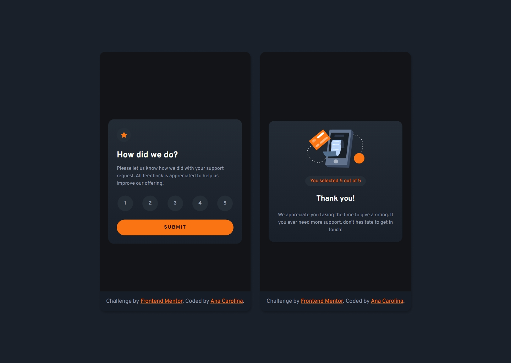

# Frontend Mentor - Interactive rating component solution

This is a solution to the [Interactive rating component challenge on Frontend Mentor](https://www.frontendmentor.io/challenges/interactive-rating-component-koxpeBUmI). Frontend Mentor challenges help you improve your coding skills by building realistic projects.

## Table of contents

- [Overview](#overview)
  - [The challenge](#the-challenge)
  - [Screenshot](#screenshot)
  - [Links](#links)
- [My process](#my-process)
  - [Built with](#built-with)
  - [What I learned](#what-i-learned)
  - [Continued development](#continued-development)
  - [Useful resources](#useful-resources)
- [Author](#author)

## Overview

### The challenge

Users should be able to:

- View the optimal layout for the app depending on their device's screen size
- See hover states for all interactive elements on the page
- Select and submit a number rating
- See the "Thank you" card state after submitting a rating

### Screenshot

### Links

- Solution URL: 
- Live Site URL: 

## My process

### Built with

- Semantic HTML5 markup
- BEM methodology
- Flexbox
- CSS Grid
- Mobile-first workflow
- JavaScript

### What I learned

Since this project is part of the learning path Introduction to web accessibility, I have been learning more about developing with accessibility in mind.

### Continued development

I look forward to continuing this learning path and learning about how to test the accessibility of web apps.

### Useful resources

- [Introduction to web accessibility](https://www.frontendmentor.io/learning-paths/introduction-to-web-accessibility-mXu-9PHVsd) - this project is part of this learning path. It's helping me learn more about accessibility.

- [Custom Controls - W3C](https://www.w3.org/WAI/tutorials/forms/custom-controls/) - provides an example of a star rating that helped determine how to approach this project.

- [The 7-1 Pattern](https://sass-guidelin.es/#architecture) - helped me organize the stylesheet.

## Author

- Frontend Mentor - [AnaCarolina](https://www.frontendmentor.io/profile/AnaCarol2001)
